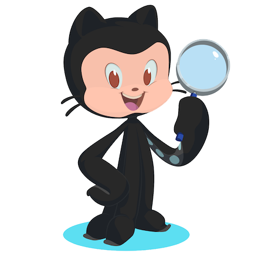
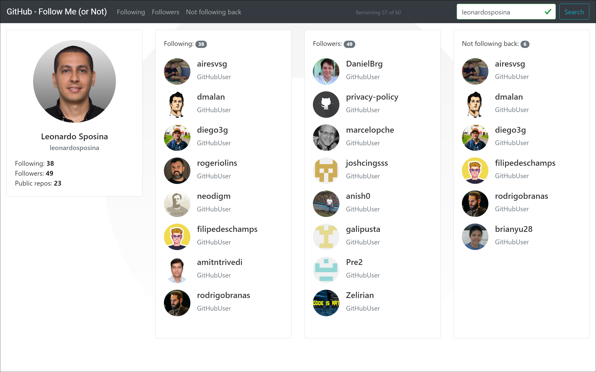
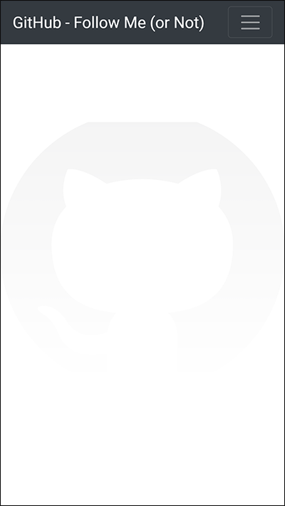
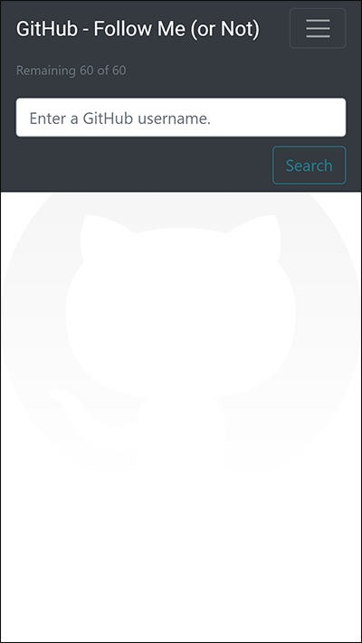
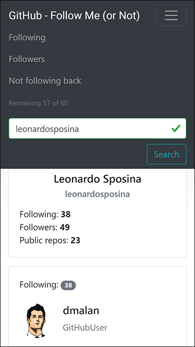
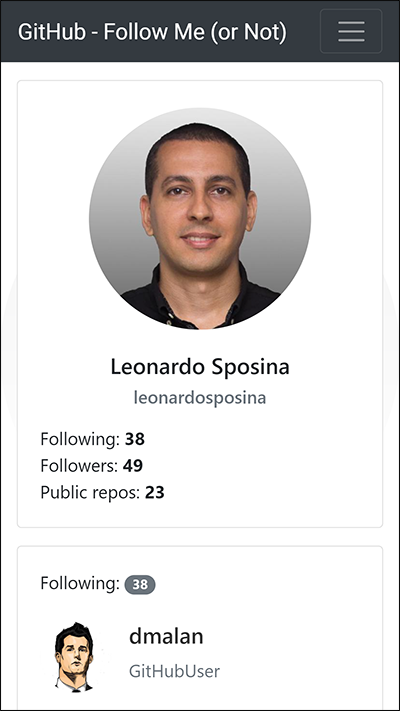
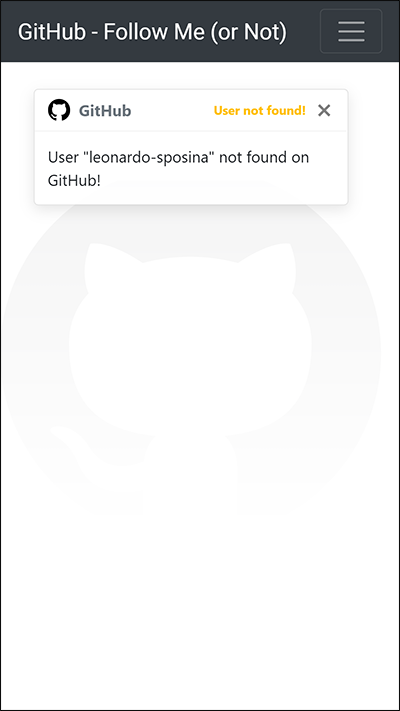
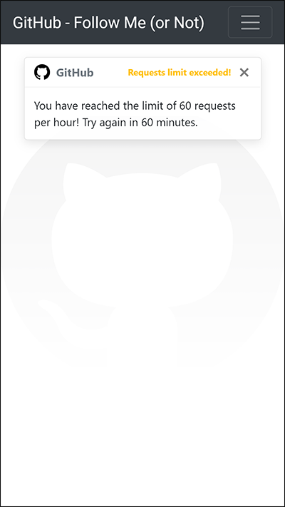

## GitHub - Follow Me (or Not)

React single page application to check if GitHub contacts are following back.

  

  🖱 Click on the picture above to visit online!

### ⚙ Technologies

- [x] JavaScript
- [x] TypeScript
- [x] ReactJS
  - [x] react-bootstrap (front-end framework)
  - [x] axios (Promise based HTTP client)
  - [x] gh-pages (GitHub Pages deploy)
- [x] GitHub
  - [x] GitHub REST API
  - [x] GitHub Pages (static website host)

### 👨‍💻 Studied concepts

- JavaScript
  - Promises
  - async / await (asynchronous functions)
- ReactJS
  - Classes
  - Interfaces
  - Components
    - Props
  - Hooks
    - useState
    - useEffect
    - useCallback
    - useContext
  - Provider
- React Bootstrap
  - Mobile-first responsive design
- GitHub
  - REST API
    - HTTP response status
  - GitHub Pages (gh-pages) deploy

### 📷 Screen captures

  

  &nbsp;
  

  &nbsp;
  

  &nbsp;
  

  &nbsp;
  

---

### 📑 References

- [ReactJS](https://reactjs.org/)
- [React Bootstrap](https://react-bootstrap.github.io/)
- [GitHub API](https://docs.github.com/en/rest)
- [GitHub Pages](https://pages.github.com/)
